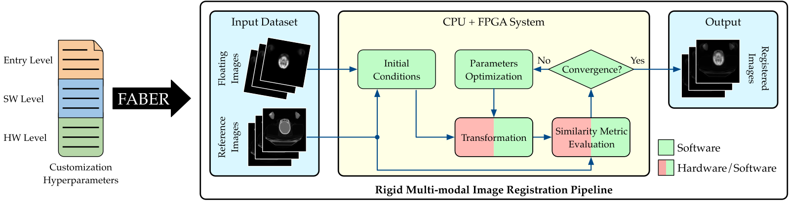

# Faber: a Hardware/Software Toolchain for Image Registration

This repository contains the source code of the Faber Toolchain. 

 <a name="faber_abstract"></a> 


Faber is an open-source HW/SW CAD framework tailored to [image registration](https://en.wikipedia.org/wiki/Image_registration) that exploits FPGAs as accelerators.
The Faber toolchain comprises HW/SW highly-tunable registration components, supports users with different expertise in building custom pipelines, and automates the design process.

The [Figure](#faber_abstract) showcases how Faber works.
Faber reads the various customization hyperparameters depending on the level of the user's knowledge and instantiates the optimization-based registration framework.
Based on the Entry, SW, or HW level, different degrees of customization are available within Faber.
Faber reads the input data, instantiates the transformation, the similarity metric, and the optimizer ([the main three components of Image Registration](https://doi.org/10.1145/3431920.3439291)).
Then, it executes the registration, providing the registered images as output. 
Both the transformation and the metric can be instantiated in software or hardware and different algorithms are provided for the optimizer and the metrics.
In this way, the user can then deploy its FPGA-based pipeline and test on its device similarly to an off-the-shelf SW library.


## Quickstart for prepare and deploy a default Accelerated pipeline on Ultra96/Alveo u200

0. Prepare your environement for Vivado/Vitis 2019.2, i.e., `source /path/to/Vivado/2019.2/settings64.sh` and `source /opt/xilinx/xrt/setup.sh` for the building machine
1. `make default_ultra96` or `make default_alveo_u200` for default Faber accelerated registration pipelines.
2. wait the bitstream generation, then `make resyn_extr_zynq_ultra96_v2` or `make resyn_extr_vts_alveo_u200`
3. `make deploybitstr` or `make deployxclbin` to deploy your accelerated pipeline on the deployment machine (if different from the building one). Pay attention to other configuration parameters. The deployment is based on rsync transfer, we are assuming all the devices are reachable from the same network of the building machine. For configuration parameters deployment have a look to [this example deployment](#deploymentexample)

For the pure sw just type `make pure_sw` and deploy on the target machine.

## In-Depth Faber Toolchain Usage Guide

### Table of contents
1. [Testing Environment](#testing_env)
2. [Code Organization](#code_org)
3. [Creating an HW-based Pipeline](#hw_design)
4. [Testing a HW Design](#testing_designs)
5. [Configuration Hyperparameters](#makefile)
    * [Optimizer Hyperparameters](#sw_hyperparams)
    * [General Makefile Hyperparameters (i.e, Entry and HW-based)](#general_params)
    * [Zynq-Specific Hyperparams.](#zynq)
    * [Alveo-Specific Hyperparams.](#alveo)
6. [Resource Results Extraction](#res_results)
7. [Estimating Resources and Latency of the Accelerators](#faber_model)
8. [Deployment Example and example of Dataset Structuring](#deploymentexample)
9. [External Components in Faber](#ext_comp)
10. [Credits and Contributors](#credits)


### Testing Environment <a name="testing_env"></a>
1. We tested the hardware code generation on two different machines based on Ubuntu 18.04/20.4 and Centos OS 7.6 respectively.
2. We used Xilinx Vitis Unified Platform and Vivado HLx toolchains 2019.2.
3. We used Python 3 with `argparse` `numpy` `math` packets on the generation machine.
4. a) On the host machines, or hardware design machines, we used Pynq 2.5 on the Zynq based platforms (Pynq-Z2, Ultra96, Zcu104), where we employ `cv2`, `numpy`, `pandas`, `multiprocessing`, `statistics`, `argparse`, `pydicom`, and `scipy` packetes. For pure SW deployment the user will also need `torch` and `kornia` packets.
4. b) We tested the Alveo u200 on a machine with CentOS 7.6, i7-4770 CPU @ 3.40GHz, and 16 GB of RAM, and we installed Pynq 2.5.1 following the [instructions by the Pynq team](https://pynq.readthedocs.io/en/v2.5.1/getting_started/alveo_getting_started.html) with the same packets as point 4a.
5. [Optional] Possible issues with locale: export LANG="en_US.utf8".

### Code Organization <a name="code_org"></a>
* `Makefile` the primary interface of Faber with users willing to generate FPGA-based IR pipelines.
* `src/` source code for HLS based design, miscellaneous utilities, Python host and testing code, and various scripts.
    * `hls/` HLS source code for both design and testbench of the Faber Library.
    * `misc/` this folder contains only the board definition files (BDF), that are properties of the board producer, we report here just for the sake of the user.
    * `model/` this folder contains the Python-based model code to get resource and latency estimations and to support expert users during the customization of the accelerators available within Faber.
    * `scripts/` miscellaneous scripts for the design generation, from tcl for Vivado and Vivado HLS to design configurator, design results extractions.
    * `scripts/generators` miscellaneous scripts for the design generation, from tcl for Vivado and Vivado HLS to design configurator and design results extractions, extensive testing campaign execution and results extraction.
    * `sw/` contains the following folders, and Faber pure IR SW pipelines based on Torch, and a Python to extract the accuracy from a Gold stack and registred stack.
        * `sw/python/` Python host source code for single accelerators test, whole accelerated application, IR library, abstraction layers of the accelerators, automatic hw mapper for different accelerators combos.
        * `sw/example_measurements/` examples of scripts to perform measurements: e.g., perform power consumption measurement with PYNQ APIs, extract the accuracy; to extract with the `python_tester_extractor.sh` the power just decomment those lines with `power_` in it.
* `platforms/` makefile utilities and configuration parameters, specific platforms makefile for the current supported boards: Ultra96, Zcu104, Alveo u200. Pynq-Z2 supports for pure Similarity Metric Accelerator, **not tested** with warp transform as stand-alone accelerator, nor with W+Metric combos.
* `dse_scripts/` scripts to automatically explore the design reported in Faber paper.
* `images/` useful images for documentation purposes.

### <a name="hw_design"></a> Creating an HW-based Pipeline: FPGA-based Accelerators generation flow

1. Source the necessary scripts, for example: `source <my_path_to_vitis>/settings64.sh`; for Alveo you will need to source xrt, e.g., `source /opt/xilinx/xrt/setup.sh`.
2. Install the board definition files (if needed) (misc folder contains them and a guide on how to install them).
3. Just do a `make`, or `make help` in the top folder for viewing an helper (other helpers `make helplat`, `make helparam`, `make helptargets` ).
4. use/modify the design space exploration script (e.g., `dsesoa.sh` or `dse_alveo_mi.sh`) or generate your designs or use single instance specific generation .
    * 4a) `make hw_gen TRGT_PLATFORM=<trgt_zynq>` for generating an instance of a Zynq-based design, where `trgt_zynq=zcu104|ultra96|pynqz2`.
    * 4b) `make hw_gen TARGET=hw OPT_LVL=3 CLK_FRQ=$FREQZ TRGT_PLATFORM=alveo_u200`  for generating an instance of the design on the Alveo u200 with target clock frequency `CLK_FRQ=$FREQZ`.
5. [Optional] Generate other instances changing the design parameters. Look at [Makefile parameters section ](#makefile) for details.

A quick example:
`make hw_gen PE=1 CORE_NR=2 TARGET=hw CLK_FRQ=200 TRGT_PLATFORM=ultra96_v2 METRIC="mse" TRANSFORM="wax";`
it generates dual core W+MSE on an Ultra96 v2 with a single PE.

### Testing a HW Design <a name="testing_designs"></a>

1. Complete at least one design in the previous section, and prepare the HW design for deployment (i.e., `make resyn_extr_zynq_ultra96_v2 ` or `make resyn_extr_vts_alveo_u200`).
2. `make pysw` creates a deploy folder for the Python code.
3. `make deploybitstr` or `make deployxclbin` `BRD_IP=<target_ip> BRD_USR=<user_name_on_remote_host> BRD_DIR=<path_to_copy>` copy onto the deploy folders the needed files.
4. connect to the remote device, i.e., via ssh `ssh <user_name_on_remote_host>@<target_ip>`.
5. [Optional] install all needed Python packages as above, or the pynq package on the Alveo host machine.
6. Navigate to the `<path/where/deployed>/sw_py`.
7. 
    * 7a) Launch the script `python_tester_launcher.sh <path/where/deployed>/bitstream_ultra96` (or where you transfered the folder of the .bit) for the Ultra96 testing.
    * 7b) Modify the script with PLATFORM=Alveo, and launch the script `python_tester_launcher.sh <path/where/deployed>/xclbn_alveo_u200` (or where you transfered the folder of the .xclbin) for the Alveo testing.
    * 7c) the script will automatically detect the accelerator configuraiton (based on the folder name) and setup the testing of both, single accelerator, powell's, and 1+1 registrations, with a dataset structured as [descirbed here](#dataset_description).
8. `python_tester_extractor.sh <path/where/deployed>/bitstream_ultra96 <name for the csv result>` to automatically derive a .csv with most of the useful results of the experimental campaign.

If you wish to have a **single test of the accelerator** for a single bitstream please follow these steps after previous step 6.
7. set `BITSTREAM=<path_to_bits>`, `CLK=200`, `CORE_NR=<target_core_numbers>`, `PLATFORM=Alveo|Zynq`, `RES_PATH=path_results`, and source xrt on the Alveo host machine,  e.g., `source /opt/xilinx/xrt/setup.sh`.
8. [Optional] `python3 test-single-mi.py --help` for a complete view of input parameters.
9. Execute the test `python3 test-single-mi.py -ol $BITSTREAM -clk $CLK -t $CORE_NR -p $PLATFORM -im 512 -rp $RES_PATH` (if on Zynq you will need `sudo`).

To execute a **single registration**, follow similar steps such as the previous single accelerator test, or [have a look here](#deploymentexample).
`python3 faber-powell-blocked.py --help` will show a complete view of input parameters for powell HW-based registration procedure.


### <a name="makefile"></a> Faber Configuration Hyperparameters 
Faber offers different level of hyperparameters that are in-depth described as follows.

#### <a name="sw_hyperparams"></a> Optimizer Hyperparameters

Faber offers SW-like hyperaparameters for optimizer-specific ones as a Python class named `FaberHyperParams` in the `faberImageRegistration.py` file.

Follows some makefile parameters (which are Entry-level, SW-level, HW-level Faber hyperparameters).

#### <a name="general_params"></a> General Makefile Parameters, and Design Configuration Parameters
* TRGT_PLATFORM=`ultra96_v2|zcu104|alveo_u200` (Entry-level)
* Image dimension D=`512|1024|2048` (Entry-level)
* Image bit size IB=`8|16` (Entry-level)
* Similarity metric METRIC=`mi|mse|cc|prz`
* Image Transforamtion TRANSFORM=`wax|empty`
* Histogram Computation type (for MI only) HT=`float|fixed`
* First Macrostage Map-Reduce PE Number PE=`1|2|4|8|16|32|64`
* Entropy PE Number (only for MI) PE_ENTROP=`1|2|4|8|16|32`
* Core Number CORE_NR=`1|2|3|4`
* Interpolation type (Warp Transform only) INTERP_TYPE=`nearestn|bilinear`
* Exploit URAM (Warp Transform only) WAX_URAM=`true|false`, not effective if no transformation kernel
* Cache dimension for the Warp Transform NUM_STORE_ROWS=`100|any number between 1 and max image size`
* Cache size befor beginning the Warp Transform kernel NUM_START_PROC=`50|any number >=1 <NUM_STORE_ROWS`
* Use caching or not (Similarity metrics only) CACHING=`true|false`
* Use URAM caching (Similarity metrics only)  URAM=`true|false`, not effective if CACHING=`false`

#### <a name="zynq"></a> Vivado and Zynq Specific Parameters Flow
* HLS_CLK=`default 10` clock period for hls synthesis
* FREQ_MHZ=`200` clock frequency for vivado block design and bitstream generation
* TOP_LVL_FN=`mutual_information_master` target top function for HLS, automatically configured by Faber
* HLS_OPTS=`5` HLS project flow. Supported options: 0 for only project build; 1 for sim only; 2 synth; 3 cosim; 4 synth and ip downto impl; 5 synth and ip export; 6 for ip export

#### <a name="alveo"></a> Alveo Specific Parameters Flow
* REPORT_FLAG=`R0|R1|R2` to report detail levels
* OPT_LVL=`0|1|2|3|s|quick` to optimization levels
* CLK_FRQ=`<target_mhz>` to ClockID 0 (board) target frequency, should be PCIe clock
* JOBS=`8` by default, if you whish you could increase/decrease accordingly 
 
### Extracting Resources Results <a name="res_results">

1. a) `make resyn_extr_zynq_<trgt_zynq>` e.g., trgt_zynq=`zcu104|ultra96|pynqz2`, set FREQ_MHZ parameter if different from default.
1. b) `make resyn_extr_vts_<trgt_alveo>` e.g., trgt_alveo=`alveo_u200`.
2. You will find in the `build/` folder a new folder with all the generated bitstreams, and in the `build/<TRGT_PLATFORM>/` directory you will find a .csv with all the synthesis results.

### Estimating Resources and Latency of the Accelerators <a name="faber_model">
Faber offers an empirical model that estimate accurately the latency and resource occupation of our Accelerators given a configuration.
For more information take a look to the corresponding [README](./src/model/README.md).


### <a name="deploymentexample"></a>  Deployment Example on Ultra96/Alveo u200/ Pure SW
An example of deployment is `make deploybitstr TRGT_PLATFORM=ultra96_v2 BRD_USR=xilinx BRD_IP=<board ip> BRD_DIR=/home/xilinx/faber` on the Ultra96.
For an Alveo u200 device `make deployxclbin TRGT_PLATFORM=alveo_u200 BRD_USR=<machine user> BRD_IP=<server ip> BRD_DIR=<path of where to deploy>`.

Connect to the host machine and go the target folder.


<a name="dataset_description"></a> 
We are assuming that the dataset is in a structure of folders such as `dataset_folder/patientname_number/Ref_folder` `dataset_folder/patientname_number/Flt_folder`, with the same amount of images for both the stacks.

For instance consider the following structure: 
  * `Test/ST0/`
    * `Test/ST0/SE0` the Reference stack 512x512x246
    * `Test/ST0/SE4` the Float stack 512x512x246

To register a stack of images on a machine that mounts an Alveo u200 (with the default accelerator configuration, i.e., Powell + MI16) with a folder structure like our example:
`python3 faber-powell-blocked.py -p Alveo -cp SE0 -pp SE4 -rp <where to save results> -ol <xclbin path> -px <relative or absolute path to the folder>/Test/ST -o 0 -pt 1 -exp -mtr mi -im 512`

To register a stack of images on a machine that mounts an Alveo u200 (with the default accelerator configuration, i.e., 1+1 + WCC1) with a folder structure like our example:
`python3 faber-oneplusone-blocked.py -p Zynq -cp SE0 -pp SE4 -rp <where to save results> -ol <bitstream path> -px <relative or absolute path to the folder>/Test/ST -o 0 -pt 1 -mtr cc -tx wax -im 512`

To register a stack of images on a machine with a SW application based on 1+1 and MSE with a folder structure like our example:
`python3 fabersw-unique.py -opt plone -cp SE0 -pp SE4 -rp <where to save results> -ol <bitstream path> -px <relative or absolute path to the folder>/Test/ST -o 0 -pt 1 -mtr mse -tx wax -im 512`


## External Components in Faber <a name="ext_comp"></a>

Faber Toolchain relies on the following external components:
* AMD-Xilinx Vivado Design Suite, Vivado HLS, Vitis Unified Software platform 2019.2.
* The [PYNQ framework](http://www.pynq.io/) and its drivers version 2.5.1 for the interfacing of Host-FPGA.
* The Warp transform Accelerator and all the necessary HLS-based parts comes from the [original repository of the Vitis Accelerated Libriaries for the Vision domain version 2019.2](https://github.com/Xilinx/Vitis_Libraries/tree/2019.2/vision). It is licensed under the [Apache License](http://www.apache.org/licenses/LICENSE-2.0).
* Several Python Packages among which: `argparse`, `numpy`, `math`, `cv2`, `numpy`, `pandas`, `multiprocessing`, `statistics`, `argparse`, `pydicom`, `os`, `glob`, `time`, `pynq`, `struct`, `scipy`, `torch`, `kornia`.
* The 1+1 code takes inspiration from [ITK code](https://github.com/InsightSoftwareConsortium/ITK).

We are really grateful to the authors of these external components without which Faber will not be possible.

## Credits and Contributors <a name="credits"></a> 

Contributors: D'Arnese Eleonora, Conficconi Davide, Del Sozzo Emanuele, Fusco Luigi, Sciuto Donatella, and Santambrogio Marco Domenico

If you find this repository useful, please use the following citation(s):

```
@article{faber2022,
title={Faber: a Hardware/Soft-ware Toolchain for Image Registration},
author={D'Arnese, Eleonora and Conficconi, Davide and Del Sozzo, Emanuele and Fusco, Luigi and Sciuto, Donatella and Santambrogio, Marco D},
journal={IEEE Transactions on Parallel and Distributed Systems},
year="2022",
publisher = "IEEE Computer Society",
address = "Los Alamitos, CA, USA",
pages = "To Appear"
}

```

```
@inproceedings{iron2021,
author = {Conficconi, Davide and D'Arnese, Eleonora and Del Sozzo, Emanuele and Sciuto, Donatella and Santambrogio, Marco D},
title = {A Framework for Customizable FPGA-based Image Registration Accelerators},
booktitle = {The 2021 ACM/SIGDA International Symposium on Field-Programmable Gate Arrays},
pages={251--261},
year = {2021}
}
```
